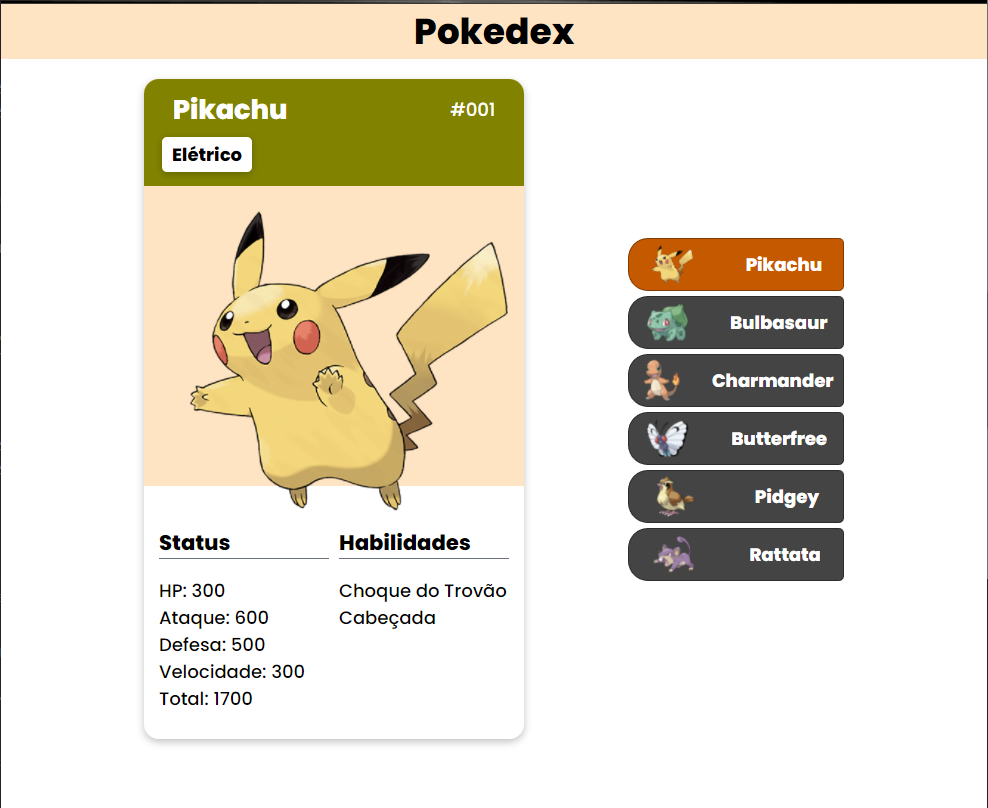
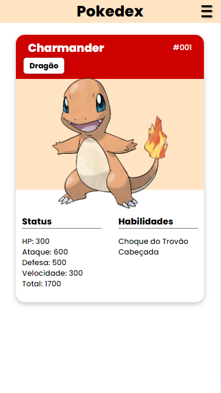
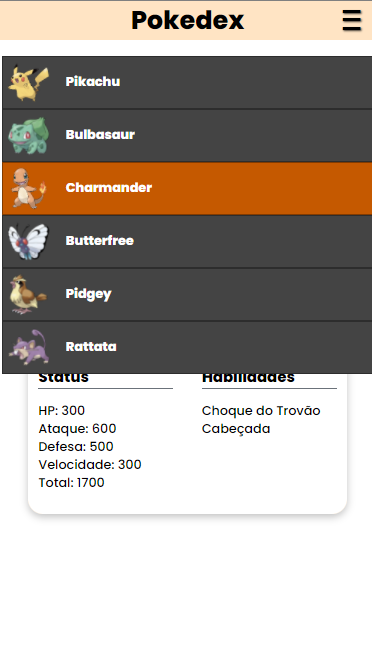
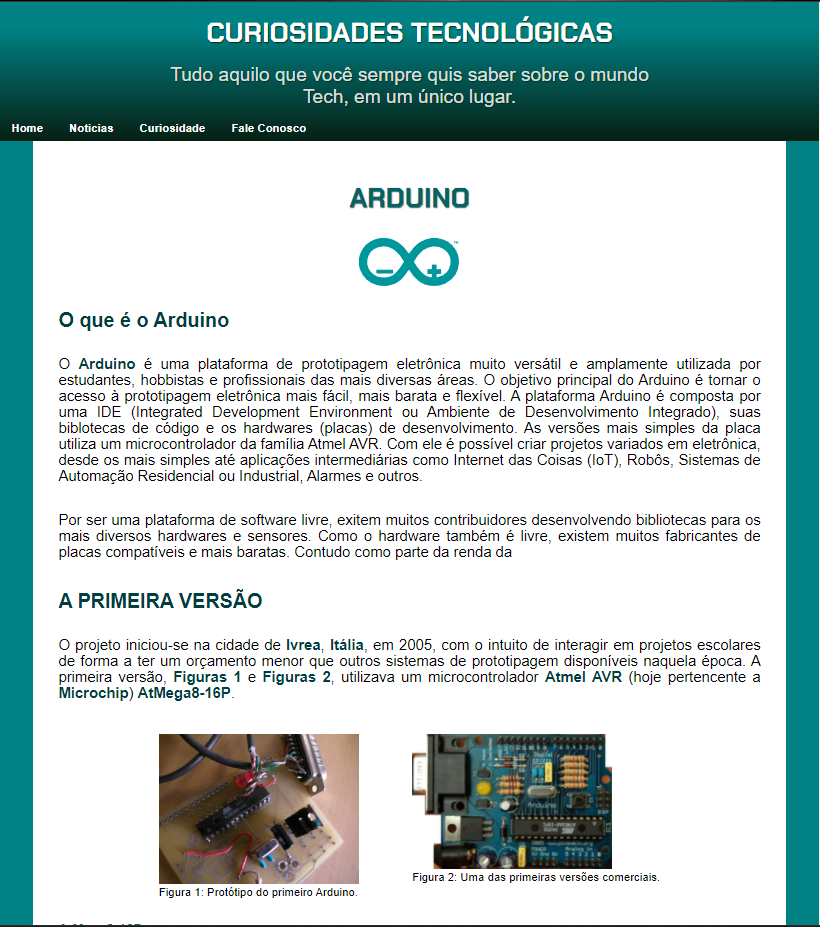
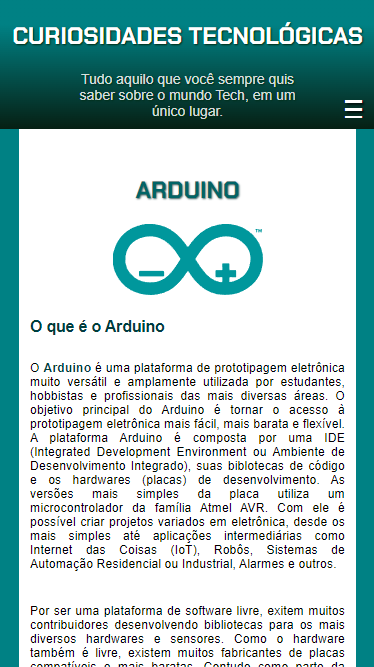
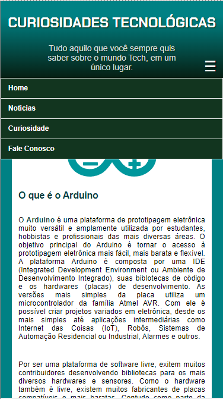

> # FMD_Portfolio_Web

Portfólio de desenvolvimento Web (Front-End, Back-End, Full-Stack)

<!-- > ### React js
>
> Projetos usando React js
>
> #### Costs

Projeto baseado no curso de React do [Matheus Battisti - Hora de Codar](https://www.youtube.com/playlist?list=PLnDvRpP8BneyVA0SZ2okm-QBojomniQVO) -->

> ## HTML5 CSS3 Javascript

Projetos usando apenas HTML5, CSS3 e Javascript.

> #### StaticPokedex

Pokedex estática utilizando somente HTML5, CSS3 e um pouco de Javascript para torná-lo responsivo.

    

    
    

> #### StaticTechBlog

Blog estático utilizando somente HTML5, CSS3 e um pouco de Javascript para torná-lo responsivo.

    

    
    

